<!------------------------------------------------------------------------------------------------->

# Quantum States for Quantum Computing  
Prepared by: <i> Ren Tristan A. de la Cruz</i> <br>
Updated on:  <i> 2023 November 09</i>

<!------------------------------------------------------------------------------------------------->
<br>

```{contents}

```

Presentation: <a href="https://github.com/quantuminnovationlaboratoryph/qilph-introduction-to-quantum-computing/blob/main/content/chapter-03/extra/chapter-03.pdf"> Slides </a>

<!------------------------------------------------------------------------------------------------->
<br>

## Introduction   
<hr>

 
Computation is information processing. In classical computing, information is encoded into strings 
of bits called <i>bit strings</i>. Bit strings are the objects of computation in classical computing.
Bit strings are the ones being processed (checked and transformed) during computation. In quantum
computing, the objects of computation are <i>quantum states</i>. In a similar manner to how a bit 
string is made up of multiple bits, a quantum state is made up of multiple <i>quantum bits (qubits).
</i> This web note is about quantum states used for quantum computing. 
 

<!------------------------------------------------------------------------------------------------->
<br>

## Classical Bit 
  
<hr>

 
The <i> classical bit</i> is the smallest unit of information. It is the amount of information you 
gain when you received an answer to a <i> yes-or-no </i> question where it is equally likely for
the answer to be a 'yes' or a 'no'. It is also amount of information you gain when the result of a
fair coin toss is revealed to you. The classical bit specifies which one of the two possible options 
occurred or was selected. 
 

 
The term <i> bit </i> is the contraction of "binary digit". Digits  $  \texttt{0}  $  and 
 $  \texttt{1}  $  are often used as the values of the classical bit. Digit  $  \texttt{0}  $  
represents one of the two possible options while the digit  $  \texttt{1}  $  represents the other 
option. Alternative pairs of values like <i>false/true</i>, <i>off/on</i>, <i>low/high</i> and
<i>-/+</i> are also used as values for the classical bit.
 

 
One <i>bit</i> of information can be stored in any system that has two distinguishable states. We 
call such systems as <i>two-state classical</i> systems. e.g. A physical on/off switch is a 
two-state system where the two states are <i>on</i> and <i>off</i>. A punched card, or specifically 
a position/location on a punched card, is a two-state system where the two states are 
<i>punched</i> (has hole) and <i>non-punched</i> (no hole). The punched card as a whole contains 
many of these two-state 'systems' and thus stores multiple bits of information.
 

<!------------------------------------------------------------------------------------------------->
###  Bit Strings   

 
To represent multiple bits of information, bits can be stringed together to form a <i>bit string</i>
(also called <i>binary strings</i>). Bit strings are needed to represent states of a system with
more than two states. For example, for a system that can be in one of four possible states  $  A, B,
C, D  $ ,  2-bit strings are needed in order to represent the four states. i.e Bit string  $ 00 $  can 
represent state  $ A $ ,   $ 01 $  can represent state  $ B $ ,  $ 10 $  can represent state  $ C $ , and 
 $ 11 $  can represent state  $ D $ . In general, if a system has  $ X $  possible states, then you need
around  $ log_2(X) $  bits to represent the states of the system. More precisely:
 

$$
\text{number of bits } = \lceil log_2(\text{number of possible options or states}) \rceil
$$

 
For example, after rolling a six-sided, it will be in one of the following six states: 
 $ 1,2,3,4,5,6 $ . Since  $  log_2(6) \approx 2.58496  $ , you need  $ 3 = \lceil log_2(6) \rceil  $  bits
to represent the six possible states of the die. i.e. String  $ 000 $  represents state  $ 1 $ ,  $ 001 $  
represents state  $ 2 $ ,  $ 010 $  represents state  $ 3 $ ,  $ 011 $  represents state  $ 4 $ ,  $ 100 $ 
represents state  $ 5 $ ,  $ 101 $  represents state  $ 6 $ , while strings  $ 110 $  and  $ 111 $  do not
represent any possible die states.  $ 3 $ -bit strings can represent 8 states while  $ 2 $ -bit strings
can only represent 4 states and so we need 3 bits to represent that states of the die.  
 

 
<b>Some Formalism:</b> The set  $ \Sigma = \{0, 1\} $  is the <i>alphabet</i> of the bit strings. The
concatenation operation  $ | $  can take two bits  $ b_1, b_2 \in \Sigma $  and form the 2-bit string
 $ b_1|b_2 $  or simply  $ b_1b_2 $ . e.g If  $ b_1=0 $  and  $ b_2=1 $ , then  $ b_1|b_2 = b_1b_2 = 01 $ .
If  $ b_1=1 $  and  $ b_2=1 $ , the  $ b_1|b_2 = b_1b_2 = 11 $ . The concatenation operation can also 
string together bit strings (not only bits). e.g. If  $ B_1 = 101 $   and  $ B_2 = 111 $ , then 
 $ B_1 | B_2 = B_1B_2 = 101111 $ . The <i>length</i> of a bit string is the number of bits is has. The 
symbol  $ \lambda $ , or sometimes  $ \varepsilon $ , denotes the <i>empty string</i>, the string with 
no symbols (bits). The set  $ \Sigma^* = \{\lambda, 0,1,00,01,10,11,...\} $ , pronounced as 
`sigma star`, is the set of all bit string of any length which includes the empty string. The 
set  $ \Sigma^+ =\{0,1,00,01,10,11,...\} $ , pronounced as `sigma plus`, is the set of all strings of
any length excluding the empty string. The set  $ \Sigma^n $  is the set of all bit strings of length
 $ n $ . i.e.  $ \Sigma^2 = \{00,01,10,11\}  $ .
 

<!------------------------------------------------------------------------------------------------->
<br>

## Quantum Bit (Qubit)
  
<hr>

 
If the classical bit is the information stored in a two-state classical system, then the 
<i> quantum bit (or qubit) </i> is the information stored in a <i>two-state quantum</i> system. In
a two-state quantum system, there is also a set with two states called the <i>basis</i>. Let the set
 $ \{\ket{A}, \ket{B}\} $  be basis of the two-state quantum system. This means that if we observe the
quantum system to determine its state, we will either observe the system in state  $ \ket{A} $  or 
observe the system in state  $ \ket{B} $ . The state  $ \ket{A} $  is pronounced as `ket A` while state
 $ \ket{B} $  is pronounced as `ket B`. This way of writing states is part of the 
<a href="https://en.wikipedia.org/wiki/Bra%E2%80%93ket_notation"><i>bra-ket notation</i></a> created
by the physicist <a href="https://en.wikipedia.org/wiki/Paul_Dirac"><i>Paul Dirac</i></a>. When you see
these <i>ket</i> notations, you know you will be dealing with quantum states and not classical 
states.
 

<!------------------------------------------------------------------------------------------------->

###  Quantum Indeterminacy   

 
Similar to a two-state classical system, when a two-state quantum system is observed/measured it will
either be in state  $ \ket{A} $  or in state  $ \ket{B} $ , given the system basis is  $ \{\ket{A}, 
\ket{B}\} $ . The quantum system has definite state when observed. But unlike a classical system, 
prior to any measurement/observation the state of a two-level quantum system can actually be 
"indefinite". This notion is known as <a href="https://en.wikipedia.org/wiki/Quantum_indeterminacy">
<b><i>quantum indeterminacy</i></b></a>. 
 

 
Quantum indeterminacy is inferred by many experiments that have been conducted during the early 
development of quantum mechanics. We sketch an abstract version of such experiments:

<ol>
<li> Have a set of identical two-state systems (i.e. All systems have the same initial state)</li>
<li> Perform the same preparation procedure for each system. </li>
<li> Measure (observe the state) each system. </li>
</ol>

If we are dealing with two-state classical systems, we expect the observed states of the systems to
be identical since the initial states of the systems are identical and the preparation procedures 
used for each system are identical. When two-state quantum systems are used in the experiment, there
are preparation procedures that can be used in the experiment such that the observed states are not
identical. In the quantum version of the experiment, the initial states of the quantum systems are 
still identical and the same preparation procedure is performed for all systems. We also note that 
the preparation procedure is formulated in such a way as to eliminate (as much as possible) external 
factors that can affect the states of the systems. In the experiment, we want the initial state and
the preparation procedure to be the only factors that affect the (prepared) state of the systems.
 

 
The figure below shows an abstract example of such experiments. There are eight two-level quantum
systems with basis  $ \{\ket{A}, \ket{B}\} $ . All eight systems are measured to be in state 
 $ \ket{A} $  initially. The same preparation procedure is performed on all eight systems. Let the 
label of the first system's state be  $ \ket{\psi_1} $ , the label of the second system's state be 
 $ \ket{\psi_2} $ , and in general the label of the  $ i $ -th system's state is  $ \ket{\psi_{i}} $ . 
After observing the quantum systems, some of systems are observed to be in state  $ \ket{A} $  while 
other are observed to be in state  $ \ket{B} $ . The implication of this experiment is that prior to 
observation (after the preparation procedure) the quantum systems' states are <i>indeterminate</i> 
(meaning "having no definite value"). It is only after measurement is performed will you get a 
definite observed state.
<br>

<!---
<div align="center">
  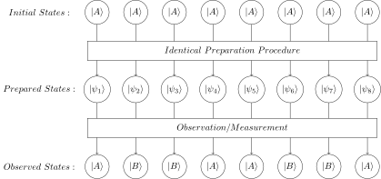
</div>
--->


```{figure} ./figures/quantum-indeterminacy.svg
---
width: 700px
name: quantum-indeterminacy
---
Quantum Indeterminacy
```
 

<!------------------------------------------------------------------------------------------------->
###  Superposition   

 
Knowing that a quantum system's state can be indeterminate, we can ask the following questions:
<ul>
<li> How does a qubit encode an indeterminate state?</li>
<li> What exactly are the information (about the two-state quantum system) that the qubit encodes?</li>
</ul>
 

 
First, as a convention we will usually use the basis  $ \{ \ket{0}, \ket{1} \} $  for two-state
quantum systems. State  $ \ket{0} $  represents one possible observable state of the system while 
 $ \ket{1} $  represents the other possible observable state. The basis states  $ \ket{0} $  and 
 $ \ket{1} $  are usually the ones used for two-state quantum systems because they are the analogues 
of the classical bits  $ 0 $  and  $ 1 $ .
 

 
Let  $ \ket{\psi} $  be the qubit for a two-state quantum system. For the case where the quantum state
is definite since the system was measured/observed, either  $ \ket{\psi} = \ket{0} $  or 
 $ \ket{\psi}=\ket{1} $ . The challenge now is encoding the information in the qubit when the system is
in an indeterminate state.
 

 
Let's rename the basis states from the experiment above. Let  $ \ket{0} = \ket{A} $   and 
 $ \ket{1} =\ket{B} $ . In the experiment above, we have a set of identically prepared two-state 
quantum systems and after observations some of the systems are observed to be in state  $ \ket{0} $  
while other systems are observed to be in state  $ \ket{1} $ . To be more precise, in the experiment
there are 8 identically prepared systems, 4 systems were observed to be in state  $ \ket{0} $  and the
other 4 systems are observed to be in state  $ \ket{1} $ . The information encoded in a qubit is the
information related to the distribution of the observed states. 
 

 
Let us specify the parameters of the experiment. Let  $ n $  be the number of the two-state quantum 
systems,  $ \ket{\psi_0} $  be the chosen initial state of the systems (which is either  $ \ket{0} $  or
 $ \ket{1} $ ), and  $ X $  be the label for the preparation procedure. Let  $ n_0 $  be the number of
systems observed to be in state  $ \ket{0} $  while  $ n_1 $  be the number of systems observed to be in
state  $ \ket{1} $ . The output of the experiment is the pair of numbers  $ p_0 $  and  $ p_1 $  where
 $ p_0 = \frac{n_0}{n} $  is the fraction of the systems observed to be in state  $ \ket{0} $  while 
 $ p_1 = \frac{n_1}{n} $  is the fraction of the systems observed to be in state  $ \ket{1} $ .
 

 
You can repeat the experiment and for every iteration of the experiment you record the output 
 $ p_0 $  and  $ p_1 $  then you can get the average of values of  $ p_0 $  and  $ p_1 $  for all iterations.
You might notice that the average values of  $ p_0 $  and  $ p_1 $  are approaching some specific values
the more interations you perform. You can also perform 'bigger' experiments by making the number of
systems  $ n $  larger. You might also notice that when you increase  $ n $  the output  $ p_0 $  and 
 $ p_1 $  are approaching some specific values. Let  $ \overline{p_0} $  be the value  $ p_0 $  approaches
as  $ n $  gets larger and let  $ \overline{p_1} $  be the value  $ p_1 $  approaches as  $ n $  gets larger.
For a given initial state  $ \ket{\psi_0} $  and preparation procedure  $ X $ , there is associated 
value for  $ \overline{p_0} $  which is the probability of observing the system in state  $ \ket{0} $ .
Note that the probability of observing the system in state  $ \ket{1} $  is  $ \overline{p_1} = (1 -
\overline{p_0}) $  so knowing the value of  $ \overline{p_0} $  it is sufficient information to know
the value of  $ \overline{p_1} $ .
 

 
We can now partially answer the second question <i> "What exactly are the information that the qubit
encodes?"</i>. One piece of information that a qubit encodes is the probability of observing state 
 $ \ket{0} $  (and by implication the probability of observing state  $ \ket{1} $ ). When the quantum 
system is observed and is in the definite state  $ \ket{\psi} $  (which is either  $ \ket{0} $  or
 $ \ket{1} $ ), then the qubit encodes the information " $  \ket{\psi}  $  with probability 1".
e.g. If state  $ \ket{0} $  is observed, then the qubit encodes the information " $ \ket{0} $  with 
probability 1" and if state  $ \ket{1} $  is observed, then the qubit encodes the information
" $ \ket{1} $  with probability 1". If the system is not observed and is in one of those states that
is indeterminate, then a qubit may encode the information " $ \ket{0} $  with probability 
 $ \overline{p_0} $  and  $ \ket{1} $  with probability  $ \overline{p_1} $ ". e.g. A qubit may encode the
information " $ \ket{0} $  with probability  $ \frac{1}{3} $  and  $ \ket{1} $  with probability 
 $ \frac{2}{3} $ ".
 

 
The probability of observing a specific basis state is not directly encoded by the qubit. The qubit 
instead encodes values called <i>amplitudes</i>, one amplitude for the basis state  $ \ket{0} $  and
one amplitude for the basis state  $ \ket{1} $ . The <i>square</i> of the amplitude of the basis state
is the probability of observing the state. If  $ \alpha $  is the amplitude of state  $ \ket{0} $  and 
 $ \beta $  is the amplitude of state  $ \ket{1} $ , then  $ |\alpha|^2 $  is the probability of observing
the state  $ \ket{0} $  and  $ |\beta|^2 $  is the probability of observing the state  $ \ket{1} $ . A
qubit  $ \ket{\psi} $  encodes the amplitudes of the basis states in the following manner: 
 

$$
\ket{\psi} = \alpha \ket{0} + \beta \ket{1}
$$

 
The state  $ \ket{\psi} $  is said to be a <a href="https://en.wikipedia.org/wiki/Quantum_superposition">
<i><b>superposition</b></i></a> of basis states  $ \ket{0} $  and  $ \ket{1} $ . The two-state quantum
system is said to be in superposition if it is in one of those indeterminate state before the system
is observed. 
 


<!------------------------------------------------------------------------------------------------->
###  Qubit Examples   

<style>
table, th, td {
  border: 1px solid black;
  border-collapse: collapse;
  text-align: center;
  padding: 10px;
}
</style>

<!---
<center>
<table style="width:70%">
  <tr>
    <th rowspan="2"> Qubit State </th>
    <th colspan="2">Amplitude of Basis:</th>
    <th colspan="2">Probability of Observing the Basis:</th>
  </tr>
  <tr>
    <td>  $  \ket{0} $  </td>
    <td>  $  \ket{1} $  </td>
    <td>  $  \ket{0} $  </td>
    <td>  $  \ket{1} $  </td>
  </tr>
  <tr>
    <td>  $  \ket{\psi_1}  = 1 \ket{0} + 0 \ket{1} = \ket{0}  $  </td>
    <td> 1 </td>
    <td> 0 </td>
    <td>  $  \left| 1 \right|^2 = 1 $  </td>
    <td>  $  \left| 0 \right|^2 = 0 $  </td>
  </tr>
  <tr>
    <td>  $  \ket{\psi_2}  = 0 \ket{0} + 1 \ket{1} = \ket{1}  $  </td>
    <td> 0 </td>
    <td> 1 </td>
    <td>  $  \left| 0 \right|^2 = 0 $  </td>
    <td>  $  \left| 1 \right|^2 = 1 $  </td>
  </tr>
  <tr>
    <td>  $  \ket{\psi_3}  = \frac{1}{\sqrt{2}} \ket{0} + \frac{1}{\sqrt{2}}  \ket{1}  $  </td>
    <td>  $  \frac{1}{\sqrt{2}}  $  </td>
    <td>  $  \frac{1}{\sqrt{2}}  $  </td>
    <td>  $  \left|\frac{1}{\sqrt{2}}\right|^2 =  \frac{1}{2}  $  </td>
    <td>  $  \left|\frac{1}{\sqrt{2}}\right|^2 =  \frac{1}{2}  $  </td>
  </tr>
  <tr>
    <td>  $  \ket{\psi_4}  = \frac{1}{\sqrt{4}} \ket{0} + \frac{\sqrt{3}}{\sqrt{4}}  \ket{1}  $  </td>
    <td>  $  \frac{1}{\sqrt{4}}  $  </td>
    <td>  $  \frac{\sqrt{3}}{\sqrt{4}}  $  </td>
    <td>  $  \left|\frac{1}{\sqrt{4}}\right|^2 =  \frac{1}{4}  $  </td>
    <td>  $  \left|\frac{\sqrt{3}}{\sqrt{4}}\right|^2 =  \frac{3}{4}  $  </td>
  </tr>
  <tr>
    <td>  $  \ket{\psi_5}  = \frac{\sqrt{5}}{\sqrt{8}} \ket{0} + \frac{\sqrt{3}}{\sqrt{8}}  \ket{1}  $  </td>
    <td>  $  \frac{\sqrt{5}}{\sqrt{8}}  $  </td>
    <td>  $  \frac{\sqrt{3}}{\sqrt{8}}  $  </td>
    <td>  $  \left|\frac{\sqrt{5}}{\sqrt{8}}\right|^2 =  \frac{5}{8}  $  </td>
    <td>  $  \left|\frac{\sqrt{3}}{\sqrt{8}}\right|^2 =  \frac{3}{8}  $  </td>
  </tr>
</table>
</center>
--->

|Qubit| Ampl. of $\ket{0}$ | Ampl. of $\ket{1}$| Prob. of $\ket{0}$ | Prob. of $\ket{1}$ |
|---|---|---|---|---|
  |  $  \ket{\psi_1}  = 1 \ket{0} + 0 \ket{1} = \ket{0}  $  | 1 | 0 |  $ 1^2 = 1$  |  $0^2 = 0 $ | 
| $  \ket{\psi_2}  = 0 \ket{0} + 1 \ket{1} = \ket{1}  $ | 0 | 1 |  $0^2 = 0 $ |  $1 ^2 = 1 $  |
| $  \ket{\psi_3}  = \frac{1}{\sqrt{2}} \ket{0} + \frac{1}{\sqrt{2}}  \ket{1}  $  |  $  \frac{1}{\sqrt{2}}  $ | $  \frac{1}{\sqrt{2}}  $ | $  \left(\frac{1}{\sqrt{2}}\right)^2 =  \frac{1}{2}  $ | $  \left(\frac{1}{\sqrt{2}}\right)^2 =  \frac{1}{2}  $  |
| $  \ket{\psi_4}  = \frac{1}{\sqrt{4}} \ket{0} + \frac{\sqrt{3}}{\sqrt{4}}  \ket{1}  $ |  $  \frac{1}{\sqrt{4}}  $ |$  \frac{\sqrt{3}}{\sqrt{4}}  $ | $  \left(\frac{1}{\sqrt{4}}\right)^2 =  \frac{1}{4}  $  |  $  \left(\frac{\sqrt{3}}{\sqrt{4}}\right)^2 =  \frac{3}{4}  $  |
| $  \ket{\psi_5}  = \frac{\sqrt{5}}{\sqrt{8}} \ket{0} + \frac{\sqrt{3}}{\sqrt{8}}  \ket{1} $ | $  \frac{\sqrt{5}}{\sqrt{8}}  $ | $  \frac{\sqrt{3}}{\sqrt{8}}  $ | $  \left(\frac{\sqrt{5}}{\sqrt{8}}\right)^2 =  \frac{5}{8}  $ |  $\left(\frac{\sqrt{3}}{\sqrt{8}}\right)^2 =  \frac{3}{8}  $ |


<!------------------------------------------------------------------------------------------------->
### Born Rule   

 
For now, let us assume that the amplitudes,  $ \alpha $  and  $ \beta $ , used in a qubit are real
numbers. The amplitudes can not be just any real numbers. The qubit amplitudes have to observe the 
following rule known as the <a href="https://en.wikipedia.org/wiki/Born_rule"><b><i>Born Rule
</i></b></a>:

$$
\alpha^2 + \beta^2 = 1
$$
 
Let  $ \overline{p_0} = a^2 $  be the probability observing the state  $ \ket{0} $  and 
 $ \overline{p_1} = b^2 $  be the probability of observing the state  $ \ket{1} $ . Recall that
 $ \overline{p_0} $  and  $ \overline{p_1} $  are complementary values. i.e. 
 $ \overline{p_0} = (1 - \overline{p_1}) $  and  $ \overline{p_1} =(1 - \overline{p_0}) $ , or 
alternately,  $ \overline{p_0} + \overline{p_1} = 1 $ . If you increase the probability 
 $ \overline{p_0} $  of observing  $ \ket{0} $ , you have to decrease the probability  $ \overline{p_1} $ 
of observing  $ \ket{1} $  and vice versa. The probabilitiy of observing  $ \ket{0} $  and the 
probability of observing  $ \ket{1} $  sum up to  $ 1 $ . The Born rule  $ a^2 + b^2 =1 $  is exactly the
probability rule  $ p_0 + p_1 = 1 $  but written in terms of amplitutes.
 

<!------------------------------------------------------------------------------------------------->
### Qubits as Points on a 2D Plane (or as Points on a Circle)  

 
A valid qubit  $ \ket{\psi} = \alpha\ket{0} + \beta\ket{1} $  can be represented by the point 
 $ (\alpha, \beta) $  on the two-dimensional  $ \alpha\beta $ -plane. If you plot all points  $ (\alpha, 
\beta) $  that represent valid qubits that follow the Born rule, then the points will form a circle 
of radius 1 centered at  $ (0,0) $  since the Born rule equation  $ a^2+b^2=1 $  is an equation for a
circle of radius 1 centered at  $ (0,0) $ . Note that we are only assuming that the amplitudes are 
real numbers and not that they are necessarily non-negative. This means we allow the amplitudes to
be negative as long as they follow the Born rule. This is why points representing valid qubits form
a circle and not just part of the circle on the  $ (+\alpha, +\beta) $  quadrant.
 

<!---
<div align="center">
  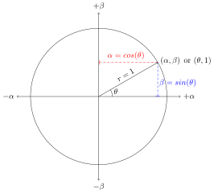
</div>
--->


```{figure} ./figures/qs-circle.svg
---
width: 550px
name: qs-circle
---
Using a Single Angle to Define Amplitudes
```

 
Any point  $ (\alpha,\beta) $  on the plane can alternately be specified by its polar coordinate
 $ (r,\theta) $  where  $ \theta $  is the direction (the angle from the  $ +\alpha $  axis) and 
 $ r $  is the radial distance from the origin  $ (0,0) $ . Since the points  $ (\alpha,\beta) $  follow
the Born rule and they all lie on the circle of radius 1 centered at  $ (0,0) $ , their polar 
coordinates follow the form  $ (r, \theta) = (1, \theta) $ . Any point on that circle can be specified
by one parameter which is the angle  $ \theta $ . Given an angle  $ \theta $ , you will have the 
corresponding point  $ (1,\theta) $  and its corresponding qubit is:

$$
\ket{\psi_\theta} = \alpha\ket{0} + \beta\ket{1} = cos(\theta)\ket{0} + sin(\theta)\ket{1}
$$

where  $ \alpha = cos(\theta) $  and  $ \beta = sin(\theta) $ .
 

 
The table below shows some examples of qubits/states specified by some angle  $ \theta $ .
 

<!---
<center>
<table style="width:75%">
  <tr>
    <th> $ \theta $ </th>
    <th> $  \alpha = cos(\theta)  $ </th>
    <th> $   \beta = sin(\theta)  $ </th>
    <th> $  \ket{\psi_\theta} = \alpha\ket{0} +\beta\ket{1}  $ </th>
  </tr>
  <tr>
    <td>  $  0  $  </td>
    <td>  $  1 $  </td>
    <td>  $  0 $  </td>
    <td>  $  \ket{\psi_0} = 1\ket{0} + 0\ket{1} = \ket{0} $  </td>
  </tr>
  <tr>
    <td>  $  \frac{\pi}{4}  $  </td>
    <td>  $  \frac{1}{\sqrt{2}} $  </td>
    <td>  $  \frac{1}{\sqrt{2}} $  </td>
    <td>  $  \ket{\psi_{\frac{\pi}{4}}} = \frac{1}{\sqrt{2}} \ket{0} + 
                                         \frac{1}{\sqrt{2}} \ket{1} $  </td>
  </tr>
  <tr>
    <td>  $  \frac{\pi}{2}  $  </td>
    <td>  $  0  $  </td>
    <td>  $  1  $  </td>
    <td>  $  \ket{\psi_{\frac{\pi}{2}}} = 0 \ket{0} + 
                                         1 \ket{1} = \ket{1} $  </td>
  </tr>
  <tr>
    <td>  $  \frac{3\pi}{4}  $  </td>
    <td>  $  -\frac{1}{\sqrt{2}}  $  </td>
    <td>  $  \frac{1}{\sqrt{2}}  $  </td>
    <td>  $  \ket{\psi_{\frac{3\pi}{4}}} = -\frac{1}{\sqrt{2}}  \ket{0} + 
                                          \frac{1}{\sqrt{2}} \ket{1}  $ </td>
  </tr>
  <tr>
    <td>  $  \pi  $  </td>
    <td>  $  -1  $  </td>
    <td>  $   0  $  </td>
    <td>  $  \ket{\psi_{\pi}} = -1 \ket{0} + 
                                0 \ket{1}  = -\ket{0} $ </td>
  </tr>
  <tr>
    <td>  $  \frac{5\pi}{4}  $  </td>
    <td>  $  -\frac{1}{\sqrt{2}}  $  </td>
    <td>  $  -\frac{1}{\sqrt{2}}  $  </td>
    <td>  $  \ket{\psi_{\frac{5\pi}{4}}} = -\frac{1}{\sqrt{2}}  \ket{0} -
                                          \frac{1}{\sqrt{2}} \ket{1}  $ </td>
  </tr>
  <tr>
    <td>  $  \frac{3\pi}{2}  $  </td>
    <td>  $  0  $  </td>
    <td>  $  -1  $  </td>
    <td>  $  \ket{\psi_{\frac{3\pi}{2}}} = 0 \ket{0} -
                                          1 \ket{1} = -\ket{1}  $ </td>
  </tr>
  <tr>
    <td>  $  \frac{7\pi}{4}  $  </td>
    <td>  $   \frac{1}{\sqrt{2}}  $  </td>
    <td>  $  -\frac{1}{\sqrt{2}}  $  </td>
    <td>  $  \ket{\psi_{\frac{7\pi}{4}}} = \frac{1}{\sqrt{2}}  \ket{0} -
                                          \frac{1}{\sqrt{2}} \ket{1}  $ </td>
  </tr>
</table>
</center>
--->

| $ \theta $| $\alpha = cos(\theta) $ | $ \beta = sin(\theta)$ | $  \ket{\psi_\theta} = \alpha\ket{0} +\beta\ket{1}  $ |
|---|---|---|---|
| $  0  $  |  $  1 $  |  $  0 $  |  $  \ket{\psi_0} = 1\ket{0} + 0\ket{1} = \ket{0} $ |
| $  \frac{\pi}{4}  $  | $  \frac{1}{\sqrt{2}} $  |   $  \frac{1}{\sqrt{2}} $ |  $  \ket{\psi_{\frac{\pi}{4}}} = \frac{1}{\sqrt{2}} \ket{0} + \frac{1}{\sqrt{2}} \ket{1} $  |
| $  \frac{\pi}{2}  $ | $  0  $  | $  1  $  |  $  \ket{\psi_{\frac{\pi}{2}}} = 0 \ket{0} +   1 \ket{1} = \ket{1} $  |
| $  \frac{3\pi}{4}  $ | $  -\frac{1}{\sqrt{2}}  $  | $  \frac{1}{\sqrt{2}}  $ | $  \ket{\psi_{\frac{3\pi}{4}}} = -\frac{1}{\sqrt{2}}  \ket{0} + \frac{1}{\sqrt{2}} \ket{1}  $ |
|$  \pi  $  |  $  -1  $ | $   0  $| $  \ket{\psi_{\pi}} = -1 \ket{0} + 0 \ket{1}  = -\ket{0} $ |
| $  \frac{5\pi}{4}  $ | $  -\frac{1}{\sqrt{2}}  $  |  $  -\frac{1}{\sqrt{2}}  $  |  $  \ket{\psi_{\frac{5\pi}{4}}} = -\frac{1}{\sqrt{2}}  \ket{0} - \frac{1}{\sqrt{2}} \ket{1}  $|
| $  \frac{3\pi}{2}  $ | $  0  $  |  $  -1  $  | $  \ket{\psi_{\frac{3\pi}{2}}} = 0 \ket{0} - 1 \ket{1} = -\ket{1}  $ |
| $  \frac{7\pi}{4}  $ | $   \frac{1}{\sqrt{2}}  $ |  $  -\frac{1}{\sqrt{2}}  $ |  $  \ket{\psi_{\frac{7\pi}{4}}} = \frac{1}{\sqrt{2}}  \ket{0} - \frac{1}{\sqrt{2}} \ket{1}  $ |

<br>
The figure below shows the qubits as points (or as arrows).
<br>

<!---
<div align="center">
  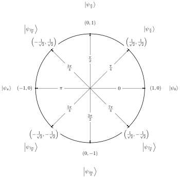
</div>
--->

```{figure} ./figures/qs-trig-circle.svg
---
width: 700px
name: qs-trig-circle
---
Trigonometric Circle
```

 
Look at the qubit  $ \ket{\psi_0} = \ket{0} $  when  $ \theta=0 $  and the qubit  $ \ket{\psi_{\pi}}= 
-\ket{0} $  when  $ \theta=\pi $ . For both qubits, you can observe their corresponding quantum
systems as being in state  $ \ket{0} $  since for both of them the probability  $ \alpha^2 $  of 
observing the system in  $ \ket{0} $  is 1 while the probability  $ \beta^2 $  of observing the system
in  $ \ket{1} $  is 0. Note that for both  $ \ket{\psi_0} $  and  $ \ket{\psi_\pi} $ , they specify the
same probabilities but they have different amplitudes. For  $ \ket{\psi_0} $ ,  $ \alpha = 1 $  while
for  $ \ket{\psi_\pi} $ ,  $ \alpha = -1 $ . When two qubits have the same probabilities but have 
different amplitudes we say that they have <b><i>different phases</i></b> or they are <b><i>out
of phase</i></b>. Informally, the <b><i>phase</i></b> of a qubit is related to its direction (or 
the angle  $ \theta $ ). The direction  $ \theta=0 $  is the opposite of the direction  $ \theta=\pi $ .
For easier visualization, instead of representing a qubit as a single point at  $ (\alpha,\beta) $  or
 $ (1,\theta) $ , you can draw an arrow from the origin to that point and this arrow will represent 
the qubit. Now it is easier to see that the arrow representing qubit  $ \ket{\psi_0} $  points in the
opposite direction of the arrow representing qubit  $ \ket{\psi_\pi} $ .
 

 
For another example, you can look at the pair of qubits  $ \ket{\psi_{\frac{\pi}{2}}} $  and 
 $ \ket{\psi_{\frac{3\pi}{2}}} $ . They both encode the probability 1 of observing  $ \ket{1} $  and
probability 0 of observing  $ \ket{0} $  but the arrows representing them point on opposite
directions.  $ \ket{\psi_\frac{\pi}{2}} $ 's arrow points directly upward while 
 $ \ket{\psi_{\frac{3\pi}{2}}} $ 's arrow points directly downward. A more interesting example is the
set of qubits  $  \ket{\psi_{\frac{\pi}{4}}},  \ket{\psi_{\frac{3\pi}{4}}}, 
\ket{\psi_{\frac{5\pi}{4}}}, \ket{\psi_{\frac{7\pi}{4}}} $  where they all encode the same
probabilities:  $ \frac{1}{2} $  probability of observing  $ \ket{0} $  and  $ \frac{1}{2} $  probability
of observing  $ \ket{1} $  but their arrows point to different directions (due to the different
signs of the amplitudes).
 

 
We can now fully answer the question <i> "What exactly are the information that the qubit encodes?"
</i>. Aside from the information about the probability of observing the state  $ \ket{0} $  and the 
probability of observing the state  $ \ket{1} $ , the qubit also encodes the phase defined by the 
amplitudes (sort of the 'direction' of the state). Using a previous example,  $ \ket{\psi_0} = 
\ket{0} $  and  $ \ket{\psi_\pi} = -1\ket{0} $  encode the sample probabilities but they have different
phases ('directions'). 
 


<!------------------------------------------------------------------------------------------------->
### Operations on a Qubit  

 
In classical computing, when you are computing with bits, there are only two operations you can do 
with some bit  $ b $ , you either let it keep its value or flip the bit (change 0 to 1 or change 1 
to 0). In quantum computing, an operation on a qubit  $ \ket{\psi} = \alpha\ket{0} + \beta\ket{1} $  
involves changing its amplitudes which means an operation can change the probabilities and phases
encoded in a qubit. Unlike operations on bits, there are an infinite number of possible operations
on a qubit.  
 


 
Let  $ U $  be a 1-qubit operator. The operator  $ U $  will take a qubit  $ \ket{\psi} = \alpha\ket{0}
+\beta\ket{1} $  and transform it to a new qubit  $ \ket{\psi'} = \alpha'\ket{0} + \beta'\ket{1} $ 

$$
\begin{align*}
U(\ket{\psi}) &= U(\alpha\ket{0} + \beta\ket{1})  \\
              &= \alpha'\ket{0} + \beta'\ket{1} \\
              &= \ket{\psi'}.
\end{align*}
$$


where  $ \alpha' $  is the new amplitude associated with state  $ \ket{0} $  and  $ \beta' $  is the new
amplitude associated with the state  $ \ket{1} $ . The transformed qubit  $ \ket{\psi'} $  should still
follow the Born rule. i.e.  $  {(a')}^2 + {(b')}^2 = 1 $ . 
 


  We can look an operator  $ U $  as being composed of two functions, function  $ f $  and function 
 $ g $ . Function  $ f $  takes the amplitudes  $ \alpha, \beta $  as input and return a new amplitude
 $ \alpha' $  associated with state  $ \ket{0} $ . Function  $ g $  takes the same amplitudes 
 $ \alpha,\beta $  as input and return a new amplitude  $ \beta' $  associated with state  $ \ket{1} $ .

<!---
<div align="center">
  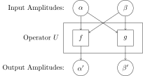
</div>
--->

```{figure} ./figures/quantum-ops-generic.svg
---
width: 500px
name: quantum-ops-generic
---
Generic 1-qubit Operator
```

$$
\begin{align*}
                        \alpha' &= f(\alpha,\beta) \\
                        \beta'  &= g(\alpha,\beta) \\
U(\alpha\ket{0} + \beta\ket{1}) &= f(\alpha,\beta)\ket{0} + g(\alpha,\beta)\ket{1} \\
\end{align*}
$$

The choice of functions  $ f, g $  should also follow the Born rule. i.e.  $  {[f(\alpha,\beta)]}^2 + 
{[g(\alpha, \beta)]}^2 = 1. $ 
 


 
For our first example of an operator on a qubit, we can look at the quantum analogue of the bit flip.
Let  $ X $  be the <i>quantum bit flip</i> (aka <i>quantum NOT</i>) operator.  $ X $  takes a qubit 
 $ \ket{\psi} = \alpha\ket{0} + \beta\ket{1} $  and returns a new qubit  $ \ket{\psi'} = \alpha'\ket{0}
+\beta'\ket{1} $  where  $ \alpha' = f(\alpha,\beta) $  and  $ \beta' =  g(\alpha,\beta)  $ . Functions 
 $ f $  and  $ g $  and operator  $ X $  are defined as follows:

$$
\begin{align*}
  \alpha' &= f(\alpha,\beta) = \beta \\
  \beta'  &= g(\alpha,\beta) = \alpha \\
  X(\alpha\ket{0} + \beta\ket{1}) &= \alpha'\ket{0} + \beta' \ket{1} \\
                                     &= f(\alpha,\beta)\ket{0} + g(\alpha,\beta)\ket{1} \\
                                     &= \beta\ket{0} + \alpha\ket{1}
\end{align*}
$$

 $ X $  swaps the amplitudes (and hence the probabilities) of states  $ \ket{0} $  and  $ \ket{1} $ .
This is why function  $ f $  returns  $ \beta $  as the new amplitude  $ \alpha' $  of state  $ \ket{0} $ 
and why function  $ g $  returns  $ \alpha $  as the new amplitude  $ \beta' $  of state  $ \ket{1} $ . If
the original qubit is either  $ \ket{\psi}=\ket{0} $  where  $  \alpha=1,\beta=0  $  or  $  \ket{\psi}
= \ket{1}  $  where  $ \alpha=0, \beta=1 $ , then quantum NOT operator behaves exactly like a classical
NOT (bit flip) operator. 

<!---
<div align="center">
  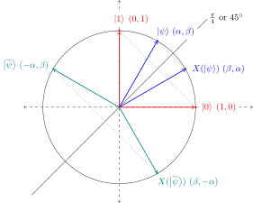
</div>
--->
 
```{figure} ./figures/quantum-ops-not.svg
---
width: 600px
name: quantum-ops-not
---
Quantum NOT Operator as Reflection
```

 
The second example is the  $ HADAMARD $  operator (or  $ H $  operator for short). The  $ H $  operator 
and its  $ f $  and  $ g $  functions are defined as follows:

$$
\begin{align*}
  \alpha' &= f(\alpha,\beta)  = \left(\frac{\alpha+\beta}{\sqrt{2}}\right)  \\
  \beta'  &= g(\alpha,\beta)  = \left(\frac{\alpha-\beta}{\sqrt{2}}\right)  \\
  H(\alpha\ket{0} + \beta\ket{1}) &= \alpha'\ket{0} + \beta'\ket{1}  \\
                                  &= f(\alpha,\beta)\ket{0} + g(\alpha,\beta)\ket{1}  \\
                                  &= \left(\frac{\alpha+\beta}{\sqrt{2}}\right)\ket{0} + 
                                     \left(\frac{\alpha-\beta}{\sqrt{2}}\right)\ket{1}  \\
\end{align*}
$$

The  $ H $  operator will often be use to put basis states  $ \ket{0} $  and  $ \ket{1} $  in superposition.
e.g. If  $ \ket{\psi} = \ket{0} = 1\ket{0} + 0\ket{1} $  where  $ \alpha=1, \beta=0 $ , then:

$$
\begin{align*}
H(\ket{0})  &= \left(\frac{\alpha+\beta}{\sqrt{2}}\right)\ket{0} +\left(\frac{\alpha-\beta}{\sqrt{2}}\right)\ket{1}\\
              &= \left(\frac{1+0}{\sqrt{2}}\right)\ket{0} +\left(\frac{1-0}{\sqrt{2}}\right)\ket{1}\\
              &=  \frac{1}{\sqrt{2}}\ket{0} + \frac{1}{\sqrt{2}}\ket{1} \\
           &= \frac{1}{\sqrt{2}} \left( \ket{0} + \ket{1} \right)
\end{align*}
$$

If  $ \ket{\psi} = \ket{1} = 0\ket{0} + 1\ket{1} $  where  $ \alpha=0, \beta=1 $ , then:

$$
\begin{align*}
H(\ket{1})  &= \left(\frac{\alpha+\beta}{\sqrt{2}}\right)\ket{0} +\left(\frac{\alpha-\beta}{\sqrt{2}}\right)\ket{1}\\
            &= \left(\frac{0+1}{\sqrt{2}}\right)\ket{0} +\left(\frac{0-1}{\sqrt{2}}\right)\ket{1}\\
            &=  \frac{1}{\sqrt{2}}\ket{0} - \frac{1}{\sqrt{2}}\ket{1} \\
            &= \frac{1}{\sqrt{2}} \left( \ket{0} - \ket{1} \right)
\end{align*}
$$

The  $ H $  operator transforms the basis state  $ \ket{0} $  to the state 
 $  \ket{+} = \left(\frac{1}{\sqrt{2}}\ket{0} + \frac{1}{\sqrt{2}}\ket{1}\right) $  and the basis 
state   $ \ket{1} $  to the state  $ \ket{-} = \left(\frac{1}{\sqrt{2}}\ket{0} - 
\frac{1}{\sqrt{2}}\ket{1}\right)  $ .

<!---
<div align="center">
  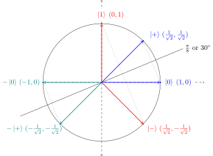
</div>
--->
 
```{figure} ./figures/quantum-ops-hadamard.svg
---
width: 600px
---
Hadamard Operator as Reflection
```

<!--- 
<div align="center">
  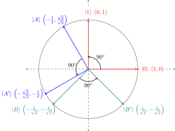
</div>
--->


 ```{figure} ./figures/quantum-ops-rotate.svg
---
width: 600px
---
Right-angle Rotation Operator
```


<!------------------------------------------------------------------------------------------------->
###  Complex Amplitudes

$$
\ket{\psi} = cos\left(\frac{\theta}{2}\right)\ket{0} + e^{i\varphi} sin\left(\frac{\theta}{2}\right) \ket{1}
$$

<!------------------------------------------------------------------------------------------------->
###  Qubits as Points in 3D Space (or as Points on a Sphere)   

<!---
<div align="center">
  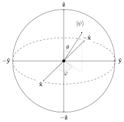
</div>
--->

 ```{figure} ./figures/qs-blochsphere.svg
---
width: 600px
---
Bloch Sphere
```


<!------------------------------------------------------------------------------------------------->
###  Qubits as Vectors   


The qubit  $  \ket{0}  $  can be represented by the column vector:

$$
\ket{0} 
= 
\begin{bmatrix}
  1 \\
  0
\end{bmatrix}
$$


The qubit  $  \ket{1}  $  can be represented by the column vector:

$$
\ket{1}
=
\begin{bmatrix}
  0 \\
  1
\end{bmatrix}
$$


The generic qubit  $  \ket{\psi} =  \alpha\ket{0} + \beta\ket{1}  $  can be represented by column
vector:

$$
\ket{\psi}
=
\begin{bmatrix}
  \alpha \\
  \beta
\end{bmatrix}
=
\alpha
\begin{bmatrix}
  1 \\
  0
\end{bmatrix}
+
\beta
\begin{bmatrix}
  0 \\
  1
\end{bmatrix}
$$

<!------------------------------------------------------------------------------------------------->

###  Qubits as Binary Trees   

Horizontal tree

<!---
<div align="center">
  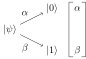
</div>
--->

 ```{figure} ./figures/qs-1qubit-htree.svg
---
width: 250px
---
Qubit as a Horizontal Binary Tree
```


Vertical Tree

<!---
<div align="center">
  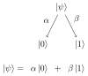
</div>
--->

 ```{figure} ./figures/qs-1qubit-vtree.svg
---
width: 300px
---
Qubit as a Vertical Binary Tree
```


<!------------------------------------------------------------------------------------------------->
<br>

## Quantum States
  
<hr>

Horizontal Tree

<!---
<div align="center">
  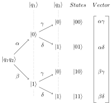
</div>
--->


``` {figure} ./figures/qs-2qubit-htree.svg
---
width: 400px
---
2-qubit State as a Horizontal Binary Treet
```

Vertical Binary Tree

<!---
<div align="center">
  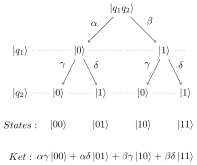
</div>
--->

``` {figure} ./figures/qs-2qubit-vtree.svg
---
width: 450px
---
2-qubit State as a Vertical Binary Treet
```


<br>

Let the first qubit be  $ \ket{q_1} $ :

$$
\ket{q_1} = \alpha \ket{0} + \beta \ket{1} 
          = \begin{bmatrix}
              \alpha \\
              \beta
            \end{bmatrix}
$$

Let the second qubit be  $ \ket{q_2} $ :

$$
\ket{q_2} = \gamma \ket{0} + \delta \ket{1}
          = \begin{bmatrix}
              \gamma \\
              \delta
            \end{bmatrix}
$$

The tensor product of  $ \ket{q_1} $  and  $ \ket{q_2} $ , denoted by  $ \ket{q_1} \otimes \ket{q_2} $  
(or simply  $ \ket{q_1q_2} $  ), is computed as follows:

$$
\begin{align*}
\ket{q_1} \otimes \ket{q_2} &= \ket{q_1q_2}  \\
                            &= (\alpha \ket{0} + \beta \ket{1})  \otimes 
                               (\gamma \ket{0} + \delta\ket{1}) \\
                            &= [(\alpha \ket{0}) \otimes (\gamma \ket{0} + \delta \ket{1})] +
                               [(\beta  \ket{1}) \otimes (\gamma \ket{0} + \delta \ket{1})] \\
                            &= [\alpha \gamma \ket{00} + \alpha \delta \ket{01}] + 
                               [\beta  \gamma \ket{10} + \beta  \delta \ket{11}] \\ 
                            &= \alpha \gamma \ket{00} + \alpha \delta \ket{01} + 
                               \beta  \gamma \ket{10} + \beta  \delta \ket{11} \\ 
\end{align*}
$$

As column vectors:

$$
\begin{align*}
\ket{q_1q_2} &= \ket{q_1} \otimes \ket{q_2} \\
             &= \begin{bmatrix}
                \alpha \\
                \beta  
                \end{bmatrix}
                \otimes
                \begin{bmatrix}
                \gamma \\
                \delta 
                \end{bmatrix} \\
             &= \begin{bmatrix}
                \alpha \begin{bmatrix}
                       \gamma \\
                       \delta
                       \end{bmatrix} \\
                \beta  \begin{bmatrix}
                       \gamma \\
                       \delta
                       \end{bmatrix}
                \end{bmatrix}
              = \begin{bmatrix}
                \alpha \cdot \gamma \\
                \alpha \cdot \delta \\
                \beta  \cdot \gamma \\
                \beta \cdot \delta
                \end{bmatrix} \\
             &= \begin{bmatrix}
                \alpha \gamma \\
                \alpha \delta \\
                \beta  \gamma \\
                \beta  \delta
                \end{bmatrix}
\end{align*}
$$

<!------------------------------------------------------------------------------------------------->
<br>

## Entanglement of Qubits
  
<hr>


Non-entangled 3-qubit state:

<!---
<div align="center">
  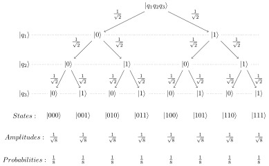
</div>
--->

<br>

```{figure} ./figures/qs-3qubit-non-entangled.svg
---
width: 700px
---
Non-entangled 3-qubit State
```


Entanglement  $ q_1 = q_3 $ :

<!---
<div align="center">
  
</div>
--->

<br>

```{figure} ./figures/qs-3qubit-q1-eq-q3.svg
---
width: 700px
---
3-qubit State with Entanglement $q_1 = q_3$
```

Entanglement  $ q_1 \neq q_2 $ :

<!---
<div align="center">
  
</div>
--->

<br>

```{figure} ./figures/qs-3qubit-q1-neq-q2.svg
---
width: 700px
---
3-qubit State with Entanglement $q_1 \neq q_2$
```


Entanglement  $ q_1 = q_2 = q_3 $ :

<!---
<div align="center">
  
</div>
--->

<br>


```{figure} ./figures/qs-3qubit-eq-q123.svg
---
width: 700px
---
3-qubit State with Entanglement $q_1 = q_2 = q_3$
```


<!------------------------------------------------------------------------------------------------->
##  Complex Numbers (Appendix)
 
<hr>

 
The set  $ \mathbb{C} $  of <i>complex numbers</i> is an extension of the set  $ \mathbb{R} $  of 
<i>real</i> numbers. A complex number  $ z $  has the form:

$$
z = a + bi
$$

where  $ a,b \in \mathbb{R} $  are real numbers and  $ i = \sqrt{-1} $  is the <i>imaginary unit</i>. We
denote the real component of the complex number  $ z $  as  $ Re(z) $  while the imaginary component is 
denoted as  $ Im(z) $ . i.e. Given  $ z=a+bi $ ,  $ Re(z) = a $  and  $ Im(z)=b $ .
 

 
A complex number can be represented as a point in a two-dimensional plane called the 
<i>Argand plane</i>. Conventionally, the horizontal axis of the plane represents the real component
of the complex number while the vertical component represents the imaginary component of the 
complex number. The complex number  $ z = a+bi  $  is represented as the point  $ (a,b) $  on  the 
plane.

<!---
<div align="center">
  
</div>
--->
 
```{figure} ./figures/comp-argand.svg
---
width: 450px
---
Argand Plane
```
 
The <i>modulus</i> (or <i>absolute value</i>) of the complex number  $ z = a + bi $  is the real 
number is:

$$
|z| = \sqrt{Re(z)^2 + Im(z)^2} = \sqrt{a^2+b^2}
$$

The modulus is the distance from the origin  $ (0,0) $  to the point  $ (a,b) $  that represents  $ z $ .
 

 
The <i>complex conjugate</i> of the complex number  $ z = a + bi $ , denoted as  $ z^* $  (or 
sometimes  $ \overline{z} $ ), is the complex number:
    
$$
z^* = a - bi
$$

 

 
The <i>square modulus</i> of the complex number  $ z=a+bi $ , denoted as  $ |z|^2 $ , is simply the 
square of its modulus.

$$
|z|^2 = Re(z)^2 + Im(z)^2 = a^2+b^2
$$

Another way of computing the square modulus is by multiplying  $ z $  with its complex conjugate 
 $ z^* $ .

$$
\begin{align*}
|z|^2 = zz^* &= (a+bi)(a-bi) \\
             &= a^2 + abi - abi - (bi)^2 \\
             &= a^2 -(i)^2b^2 \\
             &= a^2 -(-1)b^2 \\
             &= a^2 + b^2
\end{align*}
$$

 


 
The point  $ (a,b) $  on the Argand plane representing the complex number  $ z=a+bi $  can be rewritten
using a polar coordinate system. A point in a two-dimensional plane can be specified using a
radial distance  $ r $  from a fix point (the origin) and an angle  $ \theta $  between a fix axis and
the radius, line segment connecting the origin to the point. Given the point  $ (r,\theta $ ) in
polar coordinate, its coordinate in the Argand plane is  $  (a,b) = (r\cdot cos(\theta), 
r\cdot sin(\theta))  $ .
 

<!---
<div align="center">
  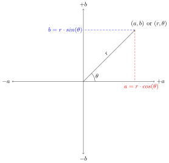
</div>
--->

```{figure} ./figures/comp-polar.svg
---
width: 550px
---
Polar Coordinates
```

 
The polar coordinate of a point representing a complex number is useful because it can be use to 
write a complex number as a <i>complex exponential</i> using <i> Euler's formula</i>. Euler's 
formula is:

$$
e^{ix} = cos(x) + sin(x) \cdot i
$$

 

We can modify Euler's formula by letting  $ x=\theta $  (the angle) and multiplying both sides of the
equation by  $ r $  (the radial distance). We will have the more general formula:

$$
re^{i\theta}  = r\cdot cos(\theta) + r \cdot sin(\theta) \cdot i 
$$

Any complex numbeer  $ z = a+bi $  can be written as the complex exponential  $ re^{i\theta} $  where
 $ (r,\theta) $  is polar coordinate equivalent of the point  $ (a,b) $  on the Argand plane 
representing the complex number  $ z $ . You can see this by starting with some point  $ (r,\theta) $ ,
in polar coordinate, representing some complex number  $ z $ . The Argand plane coordinate of
 $ (r,\theta) $  is  $ (a,b) = (r\cdot cos(\theta), r\cdot sin(\theta)) $  and complex number
represented by the point  $ (a,b) $  on the Argand plane is:

$$
\begin{align*}
z &= a+bi\\
  &= r \cdot cos(\theta) + r \cdot sin(\theta) \cdot i \\
  &= re^{i\theta}
\end{align*}
$$


<!------------------------------------------------------------------------------------------------->
